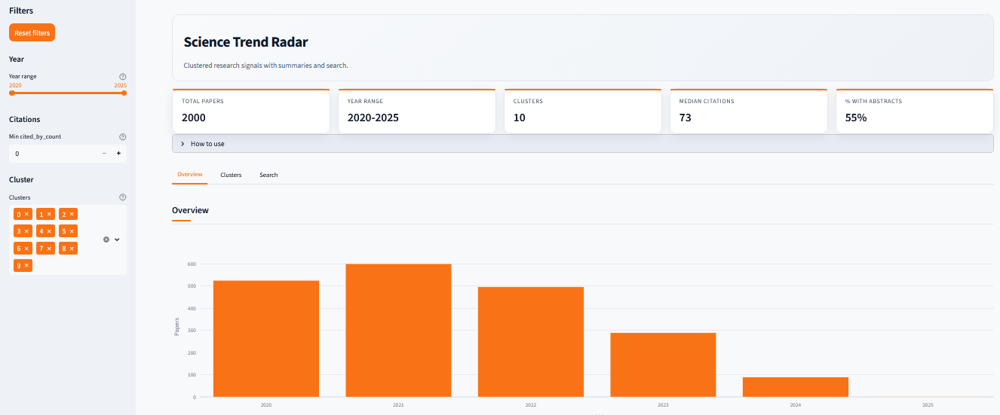
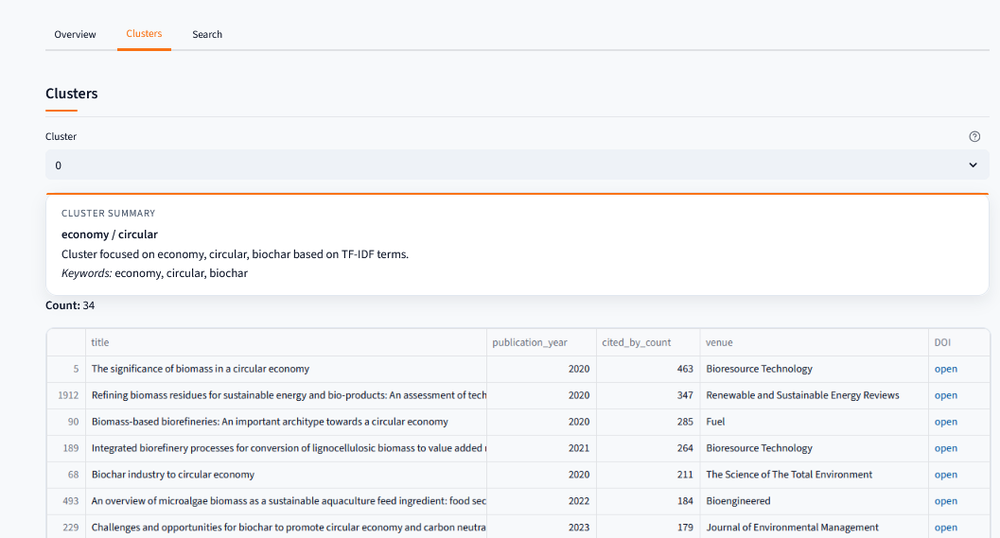
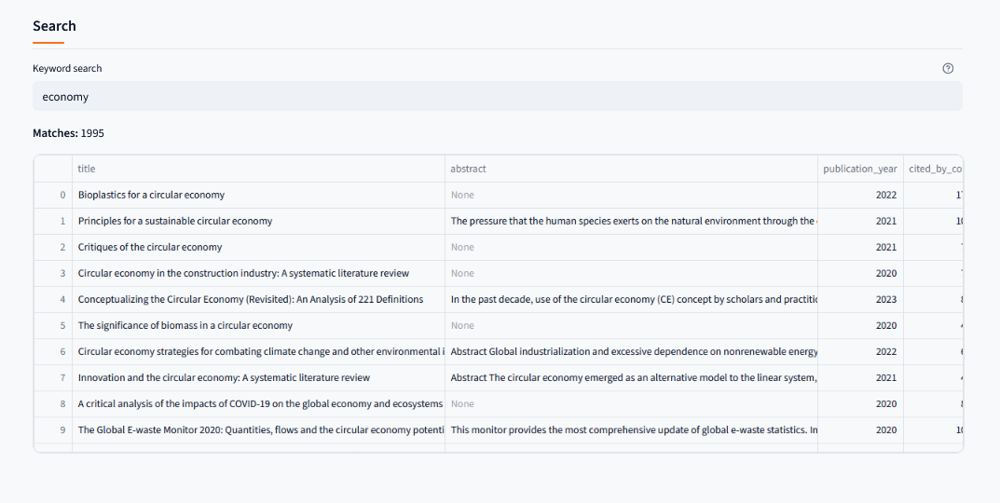

# science-trend-radar

# science-trend-radar

[](https://github.com/MRTRauf/science-trend-radar/actions/workflows/tests.yml)

Project to track and summarize research trends using OpenAlex data and a Streamlit dashboard.

## Live demo (Streamlit)
Try the dashboard here: https://science-trend-rauf.streamlit.app/

## Dashboard preview
Below are a few screenshots to show what the app looks like.

<p align="center">
  
  
  
</p>

### Notes
- The app reads precomputed artifacts under `artifacts/` (generated by the pipeline steps below).
- The live demo is deployed with a small sample dataset so it loads instantly.


## What this project does
- Pulls recent papers from OpenAlex based on a query and year range.
- Clusters papers using TF-IDF + KMeans and writes artifacts to `artifacts/`.
- Shows a Streamlit dashboard with clusters, summaries, and search.

## Quickstart
```bash
# 1) Create venv
python -m venv .venv

# 2) Activate venv (Windows)
.venv\Scripts\Activate.ps1

# 3) Install deps
python -m pip install -r requirements.txt

# 4) Run tests
python -m pytest -q
```

## Repro Steps
These commands generate the artifacts that the dashboard reads.
```bash
# 1) Ingest
python -m src.data.ingest_openalex --query "graph neural networks" --year_from 2020 --year_to 2024 --limit 500

# 2) Cluster
python -m src.features.embed_cluster --k 10

# 3) Summarize
python -m src.llm.summarize_clusters --n_samples 12

# 4) Dashboard
streamlit run app/dashboard.py
```

## Outputs (artifacts)
These files are generated by the pipeline. The live demo includes a small sample so the dashboard can run without rerunning the pipeline.


## Structure
```
app/
artifacts/
src/
  data/
  features/
  llm/
  utils/
    paths.py
tests/
```

## Theme
The Streamlit theme is configured in `.streamlit/config.toml`.

## LLM (optional)
- If `OPENAI_API_KEY` is set, summaries use the LLM.
- If not, the TF-IDF fallback still works and keeps the app usable.
- You can store the key in `.env` (do not commit it).

## Responsible AI
- Summaries only use the titles and abstracts in each cluster.
- Results depend on what OpenAlex returns and how clustering groups papers.
- Use it as a research aid, not a source of truth.

## Troubleshooting
- `pytest` not found: use `python -m pytest -q`.
- PowerShell activation blocked: `Set-ExecutionPolicy -Scope Process Bypass`.
